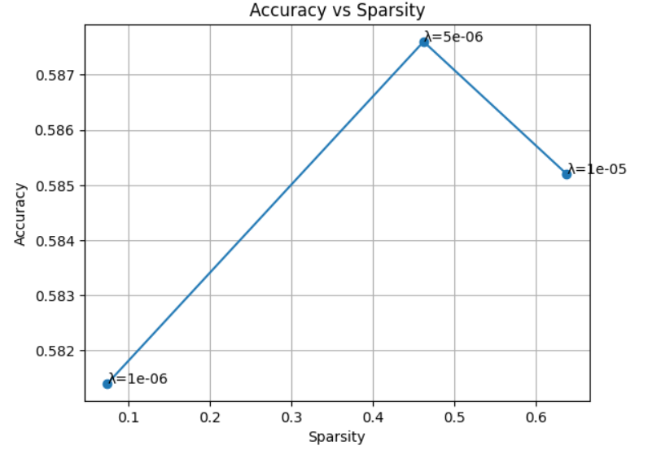
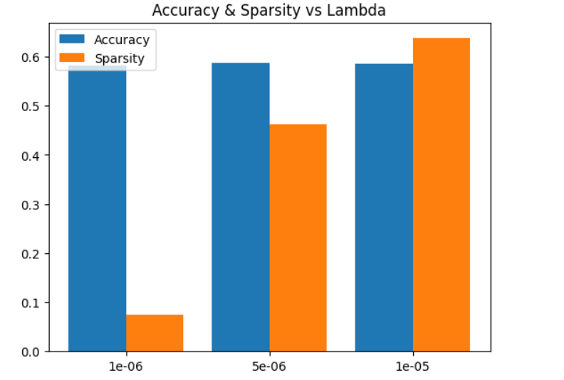
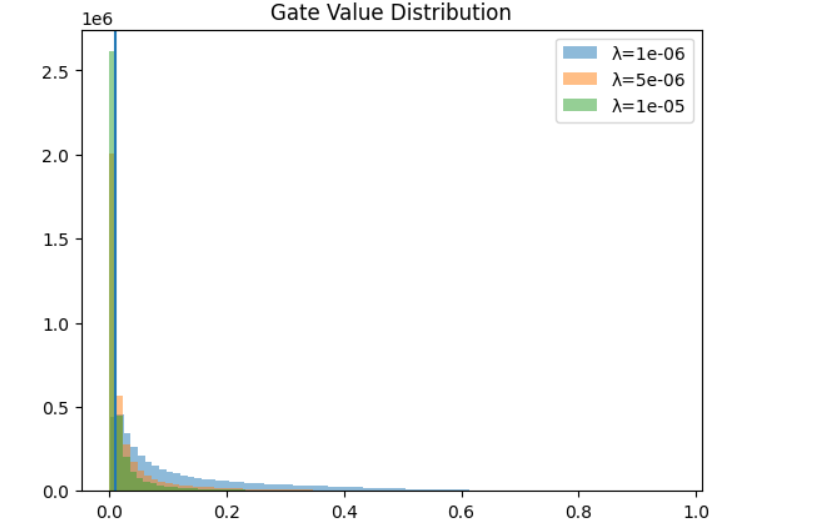
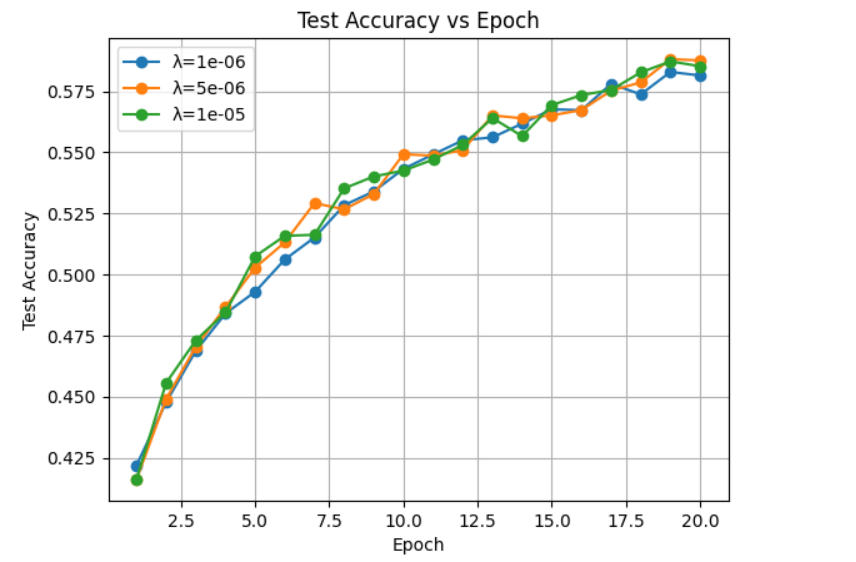

# Self-Pruning Neural Network (CIFAR-10)

A PyTorch implementation of a neural network that learns to prune its own weights during training using learnable gates and L1 regularization.

---

## Overview

Traditional pruning removes weights after training.  
This project implements dynamic self-pruning, where the model:

- Learns classification on CIFAR-10  
- Identifies unnecessary weights  
- Removes weak connections during training  

---

## Core Idea

Each weight is controlled by a learnable gate:

w_tilde = w * sigmoid(g)

- w → original weight  
- g → learnable gate score  
- sigmoid(g) ∈ (0,1)  
- small gate → weight effectively removed  

---

## Loss Function

Total Loss = CrossEntropy + λ * sum(gates)

- CrossEntropy → classification accuracy  
- λ → controls sparsity strength  
- sum(gates) → L1 penalty encouraging sparsity  

---

## Results

| Lambda | Accuracy | Sparsity |
|--------|----------|----------|
| 1e-6   | 58.2%    | 7.4%     |
| 5e-6   | 58.3%    | 45.8%    |
| 1e-5   | 58.5%    | 64.0%    |

---

## Key Observations

- Increasing λ increases sparsity  
- Higher sparsity may slightly affect accuracy  
- The model successfully balances performance and efficiency  
- Clear tradeoff between accuracy and pruning strength  

---

## Plots

### Accuracy vs Sparsity

### Accuracy and Sparsity vs Lambda

### Gate Value Distribution

### Test Accuracy Curve

---

## Architecture

- Input: 3 x 32 x 32 (CIFAR-10)  
- Layers:
  - 3072 → 1024 → 512 → 256 → 10  
- Activation: ReLU with Batch Normalization  
- Custom Layer: PrunableLinear  

---

## Tech Stack

- Python  
- PyTorch  
- NumPy  
- Matplotlib  

---

## How to Run

1. Install dependencies:
   pip install torch torchvision matplotlib numpy

2. Run the script:
   python case_study.py

---

## Conclusion

The model successfully learns to prune itself during training, achieving up to approximately 64% sparsity while maintaining competitive accuracy.

This demonstrates an effective tradeoff between model performance and computational efficiency.
